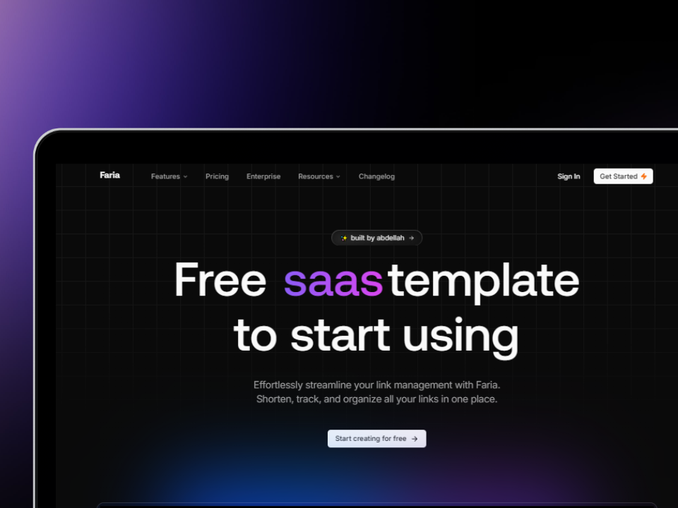

# Faria - SaaS Template Starter Kit



Faria is a powerful open-source SaaS template starter kit designed for creating customizable landing pages for saas applications .Track link performance with an integrated analytics dashboard and enhance brand identity with branded links.

## 🚀 Features

- **Link Shortening:** Easily create short links for better sharing.
- **Analytics Dashboard:** Track clicks, user engagement, and performance metrics.
- **Customizable Links:** Create branded links that reflect your identity.
- **AI-Powered Suggestions:** Get smart recommendations for link optimization.

## 🛠️ Tech Stack

- **Next.js**
- **Tailwind CSS**
- **Shadcn UI**
- **Magic UI**
- **Aceternity UI**
- **Prisma**
- **MongoDB**
- **Clerk**
- **React Hook Form**

## 🚀 Installation

To run **Faria** locally, follow these steps:

### 1. Clone the repository:

```bash
git clone [https://github.com/Shreyas-29/Faria.git](https://github.com/chrhi/saas-template.git)
```

### 2. Install dependencies:

```bash
npm install
```

### 3. Set up environment variables in a `.env` file:

```
# app
NEXT_PUBLIC_APP_DOMAIN=
NEXT_PUBLIC_APP_NAME=

# clerk
NEXT_PUBLIC_CLERK_PUBLISHABLE_KEY=
CLERK_SECRET_KEY=

# database
DATABASE_URL=
```

### 4. Run the development server:

```bash
npm run dev
```

Now you should be able to access Faria locally on `http://localhost:3000`.

If you have any questions or feedback feel free to reach out via GitHub Issues.

Built with ❤️ by Abdellah
