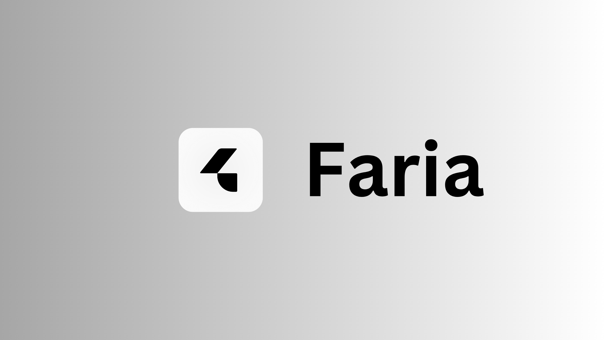

# Faria - SaaS Landing Page Template



Welcome to **Faria**, a premium SaaS landing page template designed to help you kickstart your next SaaS project or create a polished marketing page for your product. Built with modern tools like **Shadcn**, **Framer Motion**, and **Tailwind CSS**, this template offers a robust foundation for creating stunning, fully customizable websites.

---

## ✨ **Key Features**

- **Fully Responsive Design**: Adapts seamlessly to all devices.
- **Static Content**: Ideal for fast and reliable deployment with no backend requirements.
- **Modern Animations**: Powered by **Framer Motion**, delivering smooth and interactive animations.
- **Customizable Components**: Built with **Shadcn**, offering reusable UI components to match your branding.
- **Easy-to-Edit Styles**: Tailored using **Tailwind CSS** for easy customization of colors, fonts, and layouts.
- **Lucide React Icons**: Beautiful, lightweight icons included for various use cases.
- **SEO Optimized**: Follows best practices for search engine optimization.
- **Well-Organized Codebase**: Clean and modular folder structure.

---

## 🚀 **Getting Started**

### Prerequisites

Ensure the following are installed on your development environment:

- [Node.js](https://nodejs.org/) `>=16.x`
- npm, yarn, or pnpm for package management
- A basic understanding of Next.js and Tailwind CSS

---

### Installation and Setup

Follow these steps to get the template running:

1. **Clone the Repository**  
    Download the project files by cloning the repository:

   ```bash
   https://github.com/chrhi/faria.git
   ```

2. **Navigate to the Project Directory**

   ```bash
   cd faria
   ```

3. **Install Dependencies**  
   Run the following command to install the required packages:

   ```bash
   npm install
   ```

4. **Start the Development Server**  
   Start the local development server:

   ```bash
   npm run dev
   ```

5. **Open in Browser**  
   Open your browser and go to [http://localhost:3000](http://localhost:3000) to see the template in action.

---

## 📂 **Detailed Folder Structure**

Here’s an in-depth explanation of the folder structure to help you navigate the project:

```
faria/
├── components/        # Reusable UI components
│   ├── animations/    # Framer Motion components for smooth animations
│   ├── icons/         # Lucide React icons for icons used across the template
│   └── ui/            # Shadcn UI components for building blocks (e.g., buttons, modals)
│
├── pages/             # Next.js pages
│   ├── index.tsx      # Main landing page file
│   ├── _app.tsx       # Custom app configuration for global styles and providers
│   ├── _document.tsx  # Custom HTML document structure
│   └── 404.tsx        # Custom 404 error page
│
├── public/            # Static assets
│   ├── images/        # Image assets
│   ├── favicon.ico    # Favicon for the site
│   └── robots.txt     # SEO and crawler configuration
│
├── styles/            # Styling files
│   └── globals.css    # Global Tailwind CSS styles
│
├── utils/             # Utility functions
│   └── helpers.ts     # Utility functions used across the template
│
├── .env.example       # Example environment variables
├── tailwind.config.js # Tailwind CSS configuration
├── next.config.js     # Next.js configuration file
├── thumbnail.png      # Thumbnail image for the template
└── ...
```

---

## 🎨 **Customization Guide**

### 1. **Change the Branding (Logo, Title, and Favicon)**

- Replace the logo in the `public/images/` folder.
- Update the favicon by replacing `public/favicon.ico`.
- Edit the `<title>` tag in `pages/_document.tsx` to reflect your product name.

### 2. **Update Colors and Fonts**

- Open `tailwind.config.ts` to modify the primary and secondary colors:
  ```js
  theme: {
      extend: {
          colors: {
              primary: '#4F46E5',
              secondary: '#9333EA',
          },
          fontFamily: {
              heading: ['Inter', 'sans-serif'],
              body: ['Roboto', 'sans-serif'],
          },
      },
  },
  ```
- Replace the font family to match your branding.

### 3. **Edit Components**

- All reusable components are located in the `components/` directory.
- For example, edit the navigation bar by modifying `components/ui/Navbar.tsx`.

### 4. **Add New Sections**

- To add new sections to the homepage:
  - Create a new component in `components/ui/`.
  - Import and use it in `app/page.tsx`.

---

## 🌐 **Deployment Options**

### **Deploying to Vercel**

1. Build the project:
   ```bash
   npm run build
   ```
2. Push the code to a GitHub repository.
3. Go to [Vercel](https://vercel.com), import the repository, and deploy.

### **Deploying to Netlify**

1. Build the project:
   ```bash
   npm run build
   ```
2. Drag and drop the `next/` directory into the Netlify deploy interface.

---

## ❓ **Troubleshooting**

### 1. **Page Not Loading**

- **Cause**: Missing environment variables.
- **Solution**: Copy `.env.example` to `.env` and update the required fields.

### 2. **Styling Issues**

- **Cause**: Incorrect Tailwind setup.
- **Solution**: Ensure `tailwind.config.js` includes the correct paths:
  ```js
  content: ['./app/**/*.{ts,tsx}', './components/**/*.{js,ts,jsx,tsx}'],
  ```

### 3. **Framer Motion Animations Not Working**

- **Cause**: Incorrect or missing imports.
- **Solution**: Check `components/animations/` for Framer Motion configurations.

---

## 💡 **Best Practices**

1. **Use Version Control**  
   Keep your template under Git version control to track changes.

2. **Test Before Deployment**  
   Run the production build locally to catch issues:

   ```bash
   npm run build
   npm start
   ```

---

## ❓ **FAQs**

### Can I use this template for multiple projects?

Yes, the purchase grants you the right to use this template for multiple personal or client projects.

### Is backend functionality included?

No, this template is static and frontend-only. You can integrate it with your backend if needed.

### Can I request support for customization?

Yes, contact us at [abdellah.chehri14@.com](mailto:support@example.com) for assistance.

---

## 📝 **License**

This template is licensed for personal and commercial use. Redistribution or resale is prohibited.

---
